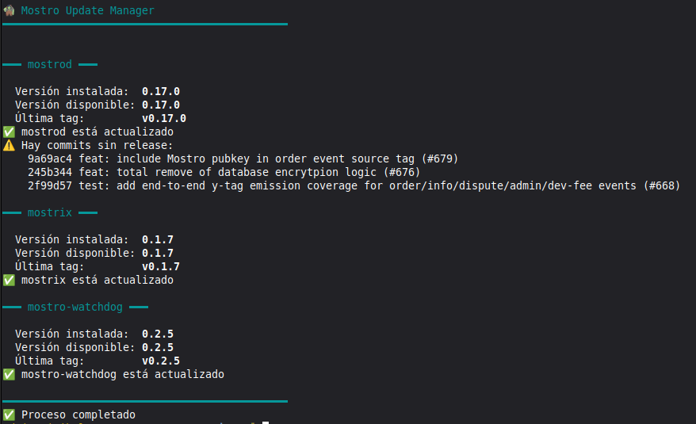
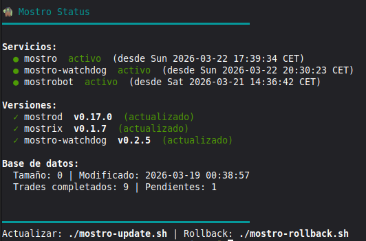
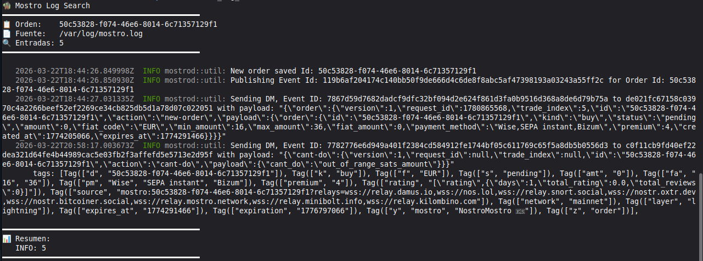

# Scripts Mostro

Scripts de gestión, monitorización y automatización para un nodo [Mostro](https://mostro.network) P2P.

## Instalación rápida

```bash
git clone git@github.com:21Mill/scripts-mostro.git
cd scripts-mostro
./setup.sh
```

El asistente interactivo te guiará para configurar todas las rutas y credenciales. Genera un archivo `.env` que todos los scripts leen automáticamente.

## Configuración manual

Si prefieres configurar a mano:

```bash
cp .env.example .env
# Edita .env con tus valores
```

Los valores comentados en `.env.example` muestran los defaults. Solo necesitas descomentar y cambiar los que difieran en tu instalación. Las variables de Telegram y Nostr sí son obligatorias si usas el bot.

### Variables de entorno

| Variable | Default | Descripción |
|----------|---------|-------------|
| `MOSTROD_SRC` | `/opt/mostro` | Directorio de fuentes de mostrod |
| `MOSTROD_CONFIG` | `$MOSTROD_SRC/settings.toml` | Configuración de mostrod |
| `MOSTROD_BIN` | `/usr/local/bin/mostrod` | Binario de mostrod |
| `MOSTROD_SERVICE` | `mostro.service` | Servicio systemd |
| `MOSTRIX_SRC` | `~/mostro-sources/mostrix` | Fuentes de mostrix |
| `MOSTRIX_CONFIG` | `~/.mostrix/settings.toml` | Configuración de mostrix |
| `MOSTRIX_BIN` | `/usr/local/bin/mostrix` | Binario de mostrix |
| `WATCHDOG_SRC` | `~/mostro-sources/mostro-watchdog` | Fuentes del watchdog |
| `WATCHDOG_CONFIG` | `$MOSTROD_SRC/config.toml` | Configuración del watchdog |
| `WATCHDOG_BIN` | `/usr/local/bin/mostro-watchdog` | Binario del watchdog |
| `WATCHDOG_SERVICE` | `mostro-watchdog.service` | Servicio systemd |
| `BACKUP_DIR` | `~/mostro-sources/backups` | Directorio de backups |
| `MOSTRO_DB` | `$MOSTROD_SRC/mostro.db` | Base de datos SQLite |
| `MOSTRO_LOG` | *(vacío = journalctl)* | Archivo de log |
| `BOT_SERVICE` | `mostrobot.service` | Servicio del bot |
| `TELEGRAM_TOKEN` | — | Token del bot de Telegram |
| `TELEGRAM_CHAT_ID` | — | Chat ID para ofertas |
| `TELEGRAM_TEST_CHAT_ID` | — | Chat ID para pruebas |
| `MOSTRO_PUBKEY` | — | Clave pública del nodo Mostro |
| `MOSTRO_RELAY` | `wss://relay.mostro.network` | URL del relay Nostr |

## Scripts

### setup.sh

Asistente interactivo de configuración. Pregunta las rutas, valida que existen, permite probar Telegram y genera el `.env`.

```bash
./setup.sh
```

### mostro-update.sh

Actualización segura de componentes Mostro (mostrod, mostrix, mostro-watchdog). Compara versiones locales vs remotas, muestra commits pendientes, hace backup antes de actualizar y recompila desde fuentes.

```bash
./mostro-update.sh              # Comprobar y actualizar todos
./mostro-update.sh mostrod      # Solo mostrod
./mostro-update.sh --check      # Solo comprobar, sin actualizar
```



### mostro-rollback.sh

Restaura una versión anterior de cualquier componente desde los backups creados por `mostro-update.sh`.

```bash
./mostro-rollback.sh            # Lista backups disponibles
./mostro-rollback.sh mostrod    # Restaurar mostrod del último backup
```

### mostro-status.sh

Muestra el estado completo del nodo: servicios activos, versiones instaladas vs disponibles, base de datos y backups.

```bash
./mostro-status.sh
```



### mostro_bot.py

Bot que escucha nuevas ofertas en el relay de Mostro y las publica en un canal de Telegram.

**Dependencias:** `pip install websocket-client requests python-dotenv`

```bash
python3 mostro_bot.py
```

### mostro_log_search.sh

Busca y formatea logs de Mostro por order ID. Usa `journalctl` por defecto o un archivo de log si `MOSTRO_LOG` está configurado.

```bash
./mostro_log_search.sh a179dca3
```



### monitor_tx.sh

Monitoriza una transacción Bitcoin hasta su confirmación y notifica por Telegram.

```bash
./monitor_tx.sh <txid>
```

### test_telegram.py

Script de prueba para verificar las credenciales de Telegram.

```bash
python3 test_telegram.py
```

## Estructura

```
.
├── .env.example          # Plantilla de configuración
├── .gitignore            # Excluye .env, logs y cache
├── images/               # Capturas de pantalla
├── mostro-env.sh         # Configuración compartida (cargado por todos los .sh)
├── setup.sh              # Asistente de configuración interactivo
├── monitor_tx.sh         # Monitor de transacciones BTC
├── mostro-rollback.sh    # Rollback de componentes
├── mostro-status.sh      # Estado del nodo
├── mostro-update.sh      # Actualización de componentes
├── mostro_bot.py         # Bot de ofertas para Telegram
├── mostro_log_search.sh  # Búsqueda en logs
└── test_telegram.py      # Test de Telegram
```
