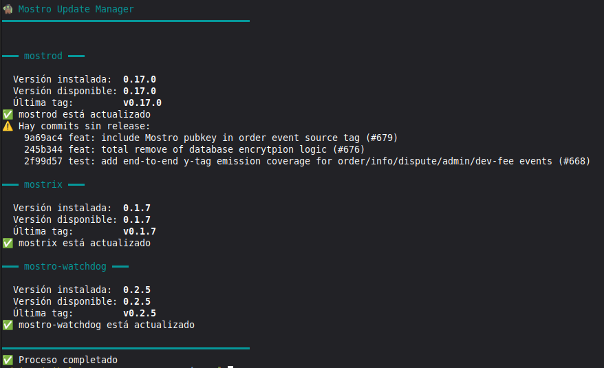
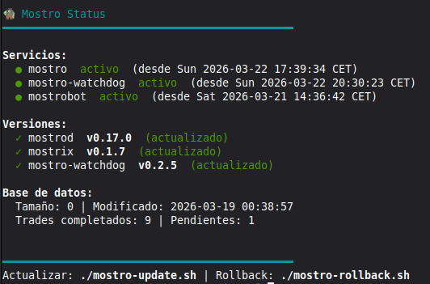
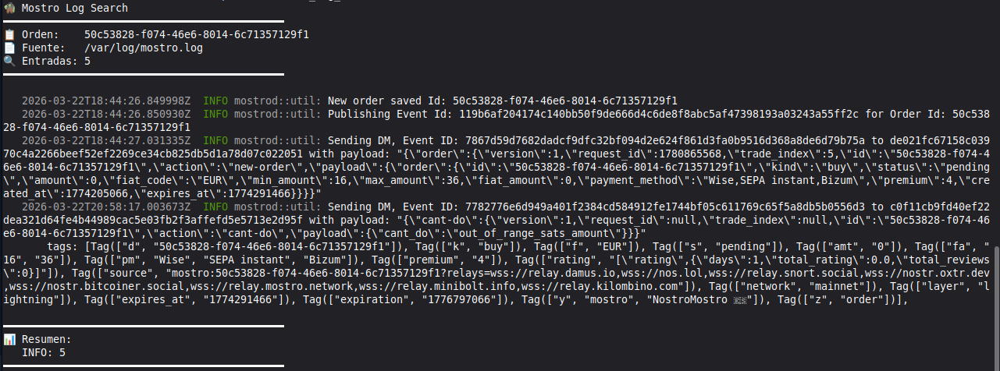

# Scripts Mostro

Scripts de gestión, monitorización y automatización para un nodo [Mostro](https://mostro.network) P2P.

## Instalación rápida

```bash
git clone git@github.com:21Mill/scripts-mostro.git
cd scripts-mostro
./admin/setup.sh
```

El asistente interactivo te guiará para configurar todas las rutas y credenciales. Genera un archivo `.env` que todos los scripts leen automáticamente.

## Configuración manual

Si prefieres configurar a mano:

```bash
cp .env.example .env
# Edita .env con tus valores
```

Los valores comentados en `.env.example` muestran los defaults. Solo necesitas descomentar y cambiar los que difieran en tu instalación. Las variables de Telegram y Nostr sí son obligatorias si usas los bots.

### Variables de entorno

| Variable | Default | Descripción |
|----------|---------|-------------|
| `MOSTROD_SRC` | `/opt/mostro` | Directorio de fuentes de mostrod |
| `MOSTROD_CONFIG` | `$MOSTROD_SRC/settings.toml` | Configuración de mostrod |
| `MOSTROD_BIN` | `/usr/local/bin/mostrod` | Binario de mostrod |
| `MOSTROD_SERVICE` | `mostro.service` | Servicio systemd |
| `MOSTRIX_SRC` | `~/mostro-sources/mostrix` | Fuentes de mostrix |
| `MOSTRIX_CONFIG` | `~/.mostrix/settings.toml` | Configuración de mostrix |
| `MOSTRIX_BIN` | `/usr/local/bin/mostrix` | Binario de mostrix |
| `WATCHDOG_SRC` | `~/mostro-sources/mostro-watchdog` | Fuentes del watchdog |
| `WATCHDOG_CONFIG` | `$MOSTROD_SRC/config.toml` | Configuración del watchdog |
| `WATCHDOG_BIN` | `/usr/local/bin/mostro-watchdog` | Binario del watchdog |
| `WATCHDOG_SERVICE` | `mostro-watchdog.service` | Servicio systemd |
| `BOT_SERVICE` | `mostrobot.service` | Servicio del bot de Telegram |
| `BOT_NOSTR_SERVICE` | `mostrobot-nostr.service` | Servicio del bot de Nostr |
| `ACCOUNTING_SERVICE` | `mostro-accounting.service` | Servicio de contabilidad |
| `SNAPSHOT_TIMER` | `mostro-snapshot.timer` | Timer de la instantánea |
| `BACKUP_DIR` | `~/mostro-sources/backups` | Directorio de backups |
| `MOSTRO_DB` | `$MOSTROD_SRC/mostro.db` | Base real. **Solo la usa `update.sh`** para el respaldo previo a una actualización |
| `MOSTRO_DB_RO` | `/var/lib/mostro-snapshot/mostro.db` | Instantánea de solo lectura. De aquí leen todas las consultas |
| `MOSTRO_DISPUTES_DB_RO` | `/var/lib/mostro-snapshot/disputes.db` | Instantánea de disputas |
| `MOSTRO_LOG` | *(vacío = journalctl)* | Archivo de log |
| `TELEGRAM_TOKEN` | — | Token del bot de ofertas |
| `TELEGRAM_CHAT_ID` | — | Canal **público** donde se publican las ofertas |
| `TELEGRAM_TEST_CHAT_ID` | — | Chat para `test-telegram.py` |
| `TELEGRAM_MONITOR_TOKEN` | — | Bot para los avisos privados al operador |
| `TELEGRAM_MONITOR_CHAT_ID` | — | Chat privado del operador (contabilidad, `monitor.sh`) |
| `TELEGRAM_STATS_TOKEN` | *(cae a `TELEGRAM_TOKEN`)* | Bot para el resumen diario y el informe mensual |
| `TELEGRAM_STATS_CHAT_ID` | — | Destino de los informes. **Sin respaldo: vacío = no se envía** |
| `TELEGRAM_STATS_CONFIG` | — | `config.toml` del que tomar `bot_token` y `chat_id`; tiene prioridad |
| `MOSTRO_PUBKEY` | — | Clave pública del nodo Mostro |
| `MOSTRO_RELAY` | `wss://relay.mostro.network` | URL del relay Nostr |
| `NOSTR_BOT_NSEC` | *(se genera automáticamente)* | Clave privada del bot de Nostr |
| `NOSTR_BOT_RELAYS` | `wss://relay.damus.io,wss://nos.lol,wss://relay.mostro.network` | Relays donde publicar ofertas |
| `NOSTROMOSTRO_WEB_REPO` | `~/nostromostro.github.io` | Repo de GitHub Pages para `premiums.json` |

> **Cuidado con `TELEGRAM_STATS_CHAT_ID`.** Si está vacío, los informes no se envían y punto. No cae a `TELEGRAM_TEST_CHAT_ID`, que apunta al canal público de ofertas: hacerlo publicaría en abierto las cuentas de la instancia. Si no sabes qué id poner, usa `bot/resolver-chat-id.py`.

## La instantánea de solo lectura

Casi todo lo que hay aquí consulta `mostro.db`, una base que pertenece al usuario `mostro`
y vive en un directorio que solo él puede abrir. La forma evidente de resolverlo era una
regla de sudo:

```
admin ALL=(mostro) NOPASSWD: /usr/bin/sqlite3
```

Y es una puerta trasera. `sqlite3` interpreta meta-órdenes también cuando la consulta llega
como argumento, así que `.shell id` da ejecución de código como `mostro` — el usuario que
posee la nsec de la instancia. Ni siquiera `-readonly` lo evita: `-readonly` bloquea
escrituras en la base, no en el sistema de ficheros, y `SELECT writefile('/ruta','x')`
escribe desde SQL puro.

En su lugar, `mostro-snapshot.timer` publica cada minuto una copia legible en
`/var/lib/mostro-snapshot/`, y las herramientas leen de ahí sin privilegio ninguno. La regla
de sudo ya no existe.

Detalles que el script documenta y conviene no perder:

- La copia se hace con `.backup`, la API de copia de SQLite, no con `cp`: las bases están en
  modo WAL y una copia byte a byte saldría corrupta.
- La copia se pasa a `journal_mode=DELETE`. Una base en WAL **no** se puede abrir en solo
  lectura sin permiso de escritura, porque SQLite necesita crear su fichero `-shm`; el error
  (`attempt to write a readonly database`) parece de permisos y no lo es.
- Para saber si la base ha cambiado se mira la fecha de `.db`, `-wal` y `-shm`. En modo WAL
  las escrituras recientes no tocan el fichero principal, así que mirar solo `.db` dejaría
  la instantánea congelada.

## Scripts

### admin/setup.sh

Asistente interactivo de configuración. Pregunta las rutas, valida que existen, permite probar Telegram y genera el `.env`.

```bash
./admin/setup.sh
```

### admin/update.sh

Actualización segura de componentes Mostro (mostrod, mostrix, mostro-watchdog). Descarga binarios precompilados desde GitHub Releases y verifica su integridad con GPG (doble firma: negrunch + arkanoider) y SHA256 antes de instalar.

Antes de cada actualización:
- Hace backup del binario, la configuración **y la base de datos** (`mostro.db`)
- Detecta si la nueva versión incluye migraciones de esquema SQLite y avisa
- Muestra commits incluidos en la actualización y cambios en la plantilla de config

Tras instalar:
- Verifica que el servicio arranca correctamente esperando los mensajes de conexión a LND y relays (hasta 30s)
- Si el servicio falla, hace **rollback automático** al binario anterior

```bash
./admin/update.sh              # Comprobar y actualizar todos
./admin/update.sh mostrod      # Solo mostrod
./admin/update.sh mostrix      # Solo mostrix
./admin/update.sh watchdog     # Solo mostro-watchdog
./admin/update.sh --check      # Solo comprobar versiones, sin actualizar
```



### admin/check_channels.sh

Comprueba el número de canales LND inactivos y envía una alerta por Telegram (al mismo canal que el watchdog) si se supera el umbral. Usa el `bot_token` y `chat_id` del archivo de configuración del watchdog (`/opt/mostro/config.toml`), sin necesidad de configuración adicional.

```bash
./admin/check_channels.sh            # Comprueba y alerta si > 2 canales caídos
./admin/check_channels.sh --status   # Muestra estado sin enviar alerta
```

La alerta incluye el número de canales caídos, el total de canales y la lista de canales inactivos con alias y capacidad.

### admin/rollback.sh

Restaura una versión anterior de cualquier componente desde los backups creados por `update.sh`.

```bash
./admin/rollback.sh            # Lista backups disponibles
./admin/rollback.sh mostrod    # Restaurar mostrod del último backup
```

### admin/status.sh

Muestra el estado completo del nodo: servicios activos, versiones instaladas vs disponibles, base de datos y backups. No necesita `sudo` para nada: los servicios se consultan directamente y los datos salen de la instantánea, cuya antigüedad se muestra para que un timer parado se note.

```bash
./admin/status.sh
```



### tools/order.sh

Consulta todos los datos de una orden en la base de datos de Mostro. Soporta búsqueda por UUID completo o parcial, y modos especiales para listar órdenes recientes, pendientes, en curso o estadísticas generales.

Muestra: tipo, estado, montos (incluyendo fiat final en órdenes con rango), comisiones (fee/routing/dev con totales), participantes (pubkeys), datos Lightning (hash/preimage/invoice), disputas, valoraciones, tiempos (con duración del trade) y trade index.

```bash
./tools/order.sh <order_id>       # Consultar una orden (UUID completo)
./tools/order.sh 7361b8fe         # Buscar por UUID parcial
./tools/order.sh --recent         # Últimas 10 órdenes
./tools/order.sh --pending        # Órdenes pendientes activas
./tools/order.sh --active         # Órdenes en curso (tomadas, no finalizadas)
./tools/order.sh --stats          # Estadísticas generales (todo el historial)
./tools/order.sh --stats 7d       # Estadísticas de la última semana
./tools/order.sh --stats 30d      # Estadísticas del último mes
./tools/order.sh --stats 2026-03-01..2026-03-23  # Entre dos fechas
```

Periodos disponibles para `--stats`: `today`/`hoy`, `24h`, `7d`/`week`/`semana`, `30d`/`month`/`mes`, `90d`/`trimestre`, `year`/`año`, `YYYY-MM-DD` (desde fecha), `YYYY-MM-DD..YYYY-MM-DD` (rango).

### tools/report.sh

Genera un informe financiero de la actividad del nodo: volumen de trading, flujo de sats, ingresos, disputas y tendencia diaria con gráfico ASCII.

```bash
./tools/report.sh              # Últimos 30 días (default)
./tools/report.sh today        # Hoy
./tools/report.sh week         # Últimos 7 días
./tools/report.sh month        # Últimos 30 días
./tools/report.sh year         # Último año
./tools/report.sh all          # Todo el historial
./tools/report.sh 2026-03-01 2026-03-31  # Rango de fechas
```

### tools/logs.sh

Busca y formatea logs de Mostro por order ID. Usa `journalctl` por defecto o un archivo de log si `MOSTRO_LOG` está configurado.

```bash
./tools/logs.sh a179dca3
```



### tools/monitor.sh

Monitoriza una transacción Bitcoin hasta su confirmación y notifica por Telegram al chat privado del operador.

```bash
./tools/monitor.sh <txid>
```

### accounting/accounting.py

Servicio de contabilidad. Sondea la instantánea cada 60 s buscando órdenes que pasan a `success`, calcula el **beneficio neto real** y avisa por Telegram al chat privado, operación a operación.

```
neto = (fee × 2) − dev_fee − routing_comprador − routing_devs
```

El `× 2` no es un error: Mostro registra en la base solo el 50 % de la comisión real. Las
comisiones de routing se sacan de LND (`lncli listpayments`), casando el
`payment_hash` de la invoice del comprador y el del pago a los desarrolladores; se
mantienen en una caché incremental para no releer todo el historial en cada ciclo.

Guarda una fila por operación en `accounting/accounting.db`, que no se versiona.

```bash
python3 accounting/accounting.py     # normalmente vía mostro-accounting.service
```

### accounting/informe-mensual.py

Informe financiero mensual al chat privado: ganancia neta con su equivalente en euros,
número de operaciones, volumen, desglose (fee cobrado, dev fee y routing) y comparativa con
el mes anterior. Agrega `accounting.db`, que ya tiene el neto calculado.

Se envía también cuando el mes no ha tenido ninguna operación: el silencio no distingue
«mes vacío» de «el cron ha fallado».

```bash
python3 accounting/informe-mensual.py                      # el mes anterior
python3 accounting/informe-mensual.py --mes 2026-04        # un mes concreto
python3 accounting/informe-mensual.py --mes 2026-04 --dry-run
python3 accounting/informe-mensual.py --force              # aunque ya se enviara
```

### bot/premiums.sh

Genera `data/premiums.json` con los premiums anonimizados, lo sube a GitHub Pages y llama a `resumen.py`. Se ejecuta cada noche vía cron.

```bash
./bot/premiums.sh
```

### bot/resumen.py

Resumen diario agregado en Telegram: trades y premium medio de las últimas 24 h y de los
últimos 30 días, precio BTC/EUR y métodos de pago más usados. Si no hubo trades en 24 h, no
envía nada.

Esa parte se alimenta de `data/premiums.json` —el mismo fichero anonimizado que ya sirve la
web— y no de la base de datos: nada de lo que salga de ahí puede revelar algo que no esté ya
publicado.

**Bloque de cuentas.** Al final del mensaje se añaden las cuentas del día recién cerrado
leídas de `accounting/accounting.db`: ganancia neta (con su equivalente en euros), volumen
intercambiado, número de operaciones, desglose de fee, dev fee y routing, y el acumulado del
mes en curso. La ventana es el día natural en hora local, el mismo criterio que las barras
del gráfico de la web y que el informe mensual —de ahí que el encabezado lleve la fecha, para
no confundirlo con la cifra de 24 h móviles que aparece más arriba en el mismo mensaje.

Eso es información privada, así que **solo se incluye si el destino se verifica privado**:
un id numérico que no sea `TELEGRAM_CHAT_ID` ni `TELEGRAM_TEST_CHAT_ID`, los dos apuntando al
canal público de ofertas. Reapuntar el resumen a un canal hace que el bloque desaparezca, no
que se publique. Si `accounting.db` no está disponible, se avisa por stdout y el resto del
resumen sale igual: una avería de la contabilidad no debe costarnos también el resumen.

```bash
python3 bot/resumen.py --dry-run    # imprime el mensaje sin enviarlo
python3 bot/resumen.py --force      # envía aunque ya se enviara hoy
```

### bot/resolver-chat-id.py

Averigua a qué chats puede escribir el bot y muestra sus identificadores, para copiar el que
corresponda a `TELEGRAM_STATS_CHAT_ID`. Escríbele algo al bot antes de ejecutarlo.

```bash
python3 bot/resolver-chat-id.py
```

### bot/bot.py

Bot que escucha nuevas ofertas en el relay de Mostro y las publica en un canal de Telegram. Cuando una oferta es tomada, cancelada o expira, el mensaje se borra automáticamente del canal.

**Dependencias:** `pip install websocket-client requests python-dotenv`

```bash
python3 bot/bot.py
python3 bot/bot.py --dry-run    # enseña qué publicaría y qué retiraría
```

### bot/bot-nostr.py

Bot que publica las ofertas como notas (kind 1) en Nostr desde un pubkey dedicado. Cuando una oferta deja de estar pendiente, envía un evento de borrado (NIP-09, kind 5). Si no existe un `NOSTR_BOT_NSEC` en el `.env`, genera las claves automáticamente.

**Dependencias:** `pip install websocket-client pynostr python-dotenv`

```bash
python3 bot/bot-nostr.py
python3 bot/bot-nostr.py --dry-run
```

### bot/test-telegram.py

Comprueba que las credenciales de Telegram funcionan, publicando en `TELEGRAM_TEST_CHAT_ID`.

```bash
python3 bot/test-telegram.py
```

## Arquitectura

`lib/` contiene lo que comparten todos los scripts de Python, y **nada de Nostr**: así los
scripts de contabilidad, que se ejecutan desde cron, no arrastran `websocket` ni `pynostr`
solo para formatear un número.

| Módulo | Contiene |
|--------|----------|
| `lib/entorno.py` | Localiza y carga el `.env`, siempre por ruta absoluta |
| `lib/formato.py` | Cifras y fechas con las convenciones españolas (`formato_sats`, `formato_euros`, `con_signo`, `fecha_larga`) |
| `lib/estado.py` | Persistencia en JSON del estado de cada script |
| `lib/telegram.py` | Envío y borrado de mensajes, y lectura de credenciales de un `config.toml` |
| `lib/contabilidad.py` | Consultas de solo lectura sobre `accounting.db` y las ventanas de día y mes en hora local |

`lib/contabilidad.py` es lo que mantiene cuadradas las dos vistas de las mismas cuentas: el
informe mensual y el bloque diario del resumen usan la misma consulta y el mismo criterio de
día local, y solo se diferencian en la ventana que le pasan.

`bot/common.py` es el módulo del relay: conexión con reconexión automática, parseo de
eventos kind 38383 y el texto de una oferta (HTML para Telegram, plano para Nostr).

La **reconciliación** (`obtener_pending` + `reconciliar`) merece una nota. Los bots retiraban
una oferta solo al ver en directo su evento de cambio de estado, así que todo lo ocurrido
mientras estaban parados no se retiraba nunca; y una oferta que caduca por NIP-40 no emite
ningún evento, de modo que en directo es indetectable por definición. Al arrancar se compara
lo publicado con el estado real del relay y se corrige en ambos sentidos. `obtener_pending`
devuelve `None` cuando el relay no contesta, y no un diccionario vacío: confundir «no queda
ninguna oferta» con «no me han contestado» vaciaría el canal entero durante una caída del
relay.

### Servicios systemd

Las unidades están versionadas en `systemd/`, con las rutas de este nodo. Para otro
directorio o usuario, ajústalas antes de instalar:

```bash
sed -i 's|/home/admin/mostro-sources/scripts|/tu/ruta|g; s|^User=admin|User=tuusuario|' systemd/*.service
sudo cp systemd/* /etc/systemd/system/
sudo install -m 755 bin/mostro-snapshot /usr/local/bin/
sudo mkdir -p /var/lib/mostro-snapshot && sudo chown mostro:admin /var/lib/mostro-snapshot
sudo chmod 2750 /var/lib/mostro-snapshot     # setgid: los ficheros heredan el grupo
sudo systemctl daemon-reload
sudo systemctl enable --now mostrobot mostrobot-nostr mostro-accounting mostro-snapshot.timer
```

El `2750` no es cosmético: sin el bit setgid, las instantáneas que crea `mostro` nacen con
grupo `mostro` y el usuario que consulta no puede leerlas.

| Unidad | Qué ejecuta |
|--------|-------------|
| `mostrobot.service` | `bot/bot.py` — ofertas en Telegram |
| `mostrobot-nostr.service` | `bot/bot-nostr.py` — ofertas en Nostr |
| `mostro-accounting.service` | `accounting/accounting.py` — contabilidad en tiempo real |
| `mostro-snapshot.service` + `.timer` | `bin/mostro-snapshot` — instantánea cada minuto |

### Cron

```cron
# Datos de la web y resumen diario en Telegram
0 0 * * * /home/admin/mostro-sources/scripts/bot/premiums.sh >> /home/admin/mostro-premiums.log 2>&1

# Alerta de canales LND caídos
*/10 * * * * /home/admin/mostro-sources/scripts/admin/check_channels.sh >> /var/log/check_channels.log 2>&1

# Informe financiero del mes recién cerrado
30 0 1 * * /usr/bin/python3 /home/admin/mostro-sources/scripts/accounting/informe-mensual.py >> /home/admin/informe-mensual.log 2>&1
```

## Tests

Sin framework: cada test es un script suelto con asserts, ejecutable tal cual en el
servidor. `run-tests.sh` los encadena y añade una comprobación de sintaxis de todos los
`.py` y `.sh`.

```bash
./run-tests.sh
```

## Estructura

```
.
├── .env.example            # Plantilla de configuración
├── .gitignore              # Excluye .env, logs, bases, orders y estado
├── run-tests.sh            # Lanza todas las comprobaciones
├── images/                 # Capturas de pantalla
├── lib/
│   ├── entorno.py          # Carga del .env por ruta absoluta
│   ├── formato.py          # Formateo de cifras y fechas
│   ├── estado.py           # Persistencia JSON
│   ├── telegram.py         # Envío por Telegram
│   ├── contabilidad.py     # Consultas sobre accounting.db y ventanas locales
│   └── test-lib.py         # Comprobaciones de lib/
├── admin/
│   ├── env.sh              # Configuración y helpers compartidos (sql_ro, telegram_enviar)
│   ├── setup.sh            # Asistente de configuración interactivo
│   ├── status.sh           # Estado del nodo
│   ├── update.sh           # Actualización de componentes (GPG+SHA256, backup BD, rollback)
│   ├── rollback.sh         # Rollback de componentes
│   └── check_channels.sh   # Alerta Telegram si >2 canales LND caídos
├── tools/
│   ├── order.sh            # Consulta de órdenes
│   ├── report.sh           # Informe financiero de actividad
│   ├── logs.sh             # Búsqueda en logs
│   └── monitor.sh          # Monitor de transacciones BTC
├── accounting/
│   ├── accounting.py       # Contabilidad en tiempo real (servicio)
│   └── informe-mensual.py  # Informe financiero mensual
├── bot/
│   ├── premiums.sh         # Generador de datos para GitHub Pages
│   ├── bot.py              # Bot de ofertas para Telegram
│   ├── bot-nostr.py        # Bot de ofertas para Nostr
│   ├── common.py           # Módulo del relay de Mostro
│   ├── resumen.py          # Resumen diario agregado
│   ├── resolver-chat-id.py # Ayuda a averiguar un chat_id
│   ├── test-telegram.py    # Test de credenciales de Telegram
│   ├── test-reconciliacion.py
│   └── test-resumen.py     # Guardia de destino y bloque de cuentas
├── systemd/                # Unidades systemd versionadas
└── bin/
    └── mostro-snapshot     # Instantánea de solo lectura de las bases
```
